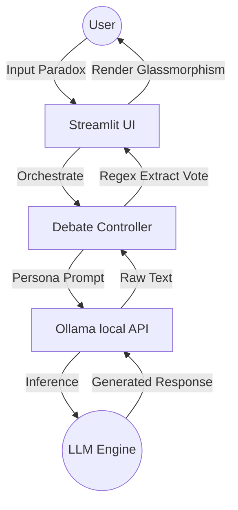

# ⚖️ AI Council Debate: High-Fidelity Deliberation Engine

<div align="center">


**_Decentralized Intelligence Meets Deterministic Rigor — A Cyber-Noir Deliberation Platform_**

🧡 Code Hard &nbsp;·&nbsp; 🤍 Think Deep &nbsp;·&nbsp; 💚 Debate Fair

[Technical Docs](#-technical-architecture) · [The Council](#-logic--personalities) · [Installation](#-deployment) · [UI/UX](#-uiux-engineering) · [Author](#-author)

</div>

---

## 📌 Executive Summary

**AI Council Debate** is an advanced multi-agent deliberation framework designed for local LLM orchestration. Built on the **Streamlit** ecosystem and interfaced via **Ollama**, it simulates a high-stakes legislative environment where 17 distinct AI personas—each with unique cognitive biases and logical frameworks—debate user-defined paradoxes and ethical dilemmas.

The platform utilizes custom **CSS/JS injection** to achieve a "Cyber-Noir" aesthetic, featuring glassmorphism, animated scanlines, and real-time state-syncing thinking signatures.

---

## 🏗️ Technical Architecture

The system operates on an asynchronous request-response loop between the Streamlit front-end and the local Ollama inference server.



### Key Components:
- **Orchestration**: Manages turn-based logic, context accumulation, and word-limit enforcement.
- **State Management**: Uses `st.session_state` to maintain a consistent "Council History" across re-runs.
- **Inference**: High-speed local processing via Ollama, supporting models like `Gemma-2-2b` or `Llama-3-8b`.

---

## 🎭 Logic & Personalities

Unlike standard chatbots, each council member follows a **3-Tier Personality Matrix**:

1.  **Identity Layer**: Defines the core archetype (e.g., *The Historian* prefers precedent over speculation).
2.  **Constraint Layer**: Strict word-range enforcement (60-120 words) to prevent "Model Rambling."
3.  **Deterministic Vote Rule**: Every response is regex-parsed for exactly one tag: `[VOTE: YES]`, `[VOTE: NO]`, or `[VOTE: NEUTRAL]`.

### 🏛️ The Expanded 17-Agent Council

| Archetype | Cognitive Driver | Primary Focus |
|---|---|---|
| **The Analyst** | Logic | Statistical viability and structural integrity. |
| **The Sage** | Wisdom | Cross-cultural metaphors and timeless patterns. |
| **The Devil** | Inversion | Counter-consensus stress-testing. |
| **The Conspiracist** | Skepticism | Identifying hidden power dynamics and agendas. |
| **The Psychologist** | Behavior | Profiling the biases of other agents in the room. |
| **The Historian** | Precedent | Comparing current dilemmas to past human failures. |

---

## 🎨 UI/UX Engineering (Cyber-Noir)

The "Chamber" aesthetic is achieved through advanced styling techniques:

- **Glassmorphism 2.0**: Utilizing `backdrop-filter: blur(12px)` and `rgba(20, 20, 30, 0.4)` for deep, translucent container depth.
- **CRT Scanlines**: A global fixed `linear-gradient` overlay mimicking the visual texture of high-contrast cyber-noir displays.
- **Dynamic Feedback**: speaking banners use custom-styled pulse animations and personality-specific "thinking signatures."
- **Animated Grid**: A 4-column responsive grid featuring light-sweep animations on hover and smooth state transitions.

---

## 📦 Deployment & Setup

### Requirements
- **Hardware**: 8GB+ VRAM recommended (for 7B+ models) or 4GB+ for 2B models.
- **Runtime**: Python 3.9+, [Ollama](https://ollama.com/) 0.1.32+.

### Quick Start
```bash
# Clone
git clone https://github.com/samruddhabelsare/ai-council-debate.git && cd ai-council-debate

# Environment
pip install streamlit requests

# Model Pull
ollama pull gemma2:2b

# Launch
streamlit run app.py
```

---

## 🔮 Future Roadmap (v2.0)
- [ ] **Vector Context**: Integrating RAG to allow agents to "read" specific documents before debating.
- [ ] **Cross-Agent Awareness**: Deeper cross-referencing where agents explicitly name-call and counter each other.
- [ ] **Export Logic**: One-click PDF export of the Full Council Minutes and Tally.
- [ ] **Dynamic Temperature**: Adjusting "Logical Chaos" (LLM Temperature) on the fly.

---

## 👨‍💻 Author

<div align="center">

**Samruddha Belsare**

🇮🇳 &nbsp; India &nbsp; · &nbsp; Lead Architect

*"Coding is Rice plate eating — I don't like Rice as much as Coding."*

Developed with ❤️ and Advanced Agentic AI.

---

### ◈◈◈◈◈◈◈◈◈◈◈◈◈◈◈◈◈◈◈◈◈◈◈◈◈◈◈◈◈◈◈◈◈◈◈◈◈◈◈◈◈
**AI COUNCIL DEBATE · Engineering Excellence**
Built with Streamlit · Ollama · Determination
🧡 Work Hard 🤍 Stay Focused 💚 Shine Bright
### ◈◈◈◈◈◈◈◈◈◈◈◈◈◈◈◈◈◈◈◈◈◈◈◈◈◈◈◈◈◈◈◈◈◈◈◈◈◈◈◈◈

</div>
